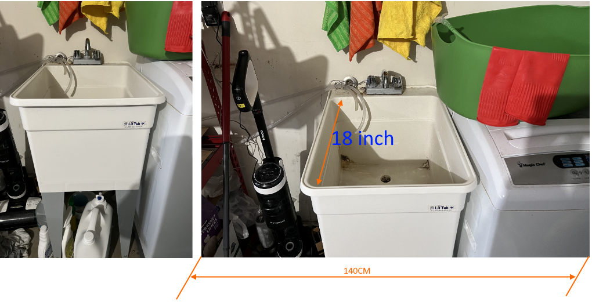

# 最简单的车库洗衣台

之前刚move到新买的房子里面，找的朋友帮忙搭建的laundry 洗衣台。
在 home depot（美国家居建材连锁店，股票代码HD，很大的公司）买的 utiliy sink。
之前还不知道这个学名，一直google： laundry big sink, 不过google 很smart，会给你指向 utility sink!

改造前图片如下, so messy :)

<table>
<tbody>
<tr>
<td>

</td>
</tr>
</tbody>
</table>

不想改动原先的排水，去Home Depot 转了一圈后，先看改造后的真实图：

购买清单与英文名称如下：

**- 2X4-8FT Prime Fir （优质冷杉）**
<table>
<tbody>
<tr>
<td>

</td>
</tr>
</tbody>
</table>

标签上的 STD/BTR 是 Standard & better的意思
是 Common Lumber Abbreviations and Terms，是 lumber 木头的grades 缩写，美国都是用木头造房子的。

查了一下，大致是：

Grades A  |  comments
--------- |----------
 BTR      | Better  
 #1BTR    | 1号better 
 #1BTR    | B3 
 #1BTR    | B3 
 B&B	  | B & Better
CON COM	  | Construction Common Redwood
CON HEART |	Construction Heart Redwood
STD BTR	  | Standard & Better

**- Countertop**

<table>
<tbody>
<tr>
<td>

</td>
</tr>
</tbody>
</table>

Laminate Countertops: 层压板台面

**Tesla 把后排座位放倒就可以放下台面了。**
